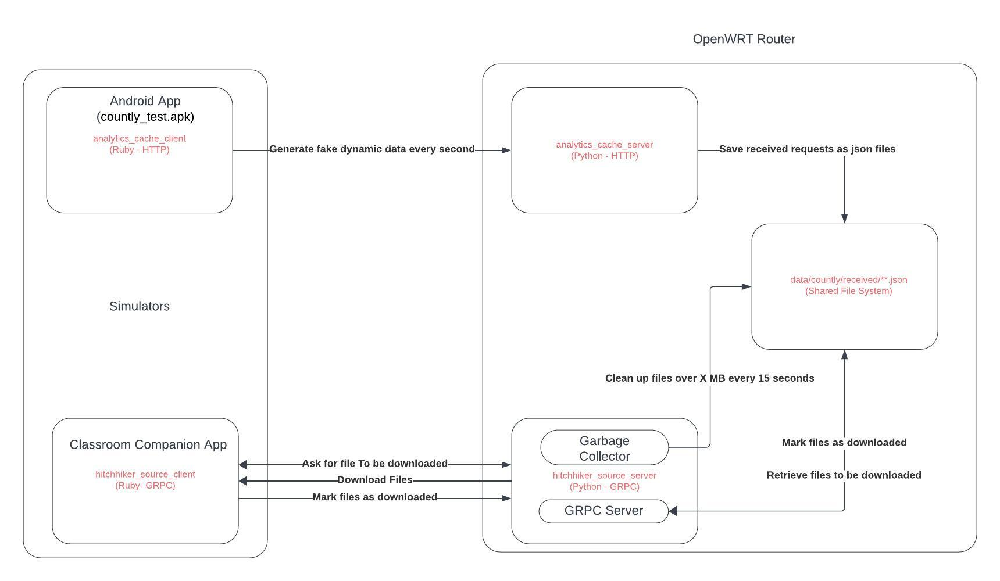

# Hitchhiker Source Simulator/Server

## Overview
This document provides setup and operational instructions for the following system components:

1. `analytics_cache_client`: A simulator acting as an Android App (`countly_test.apk`) written in Ruby.
2. `analytics_cache_server`: A server written in Python, to be deployed on an OpenWRT router, providing an HTTP endpoint.
3. `hitchhiker_source_client`: A simulator for the Classroom Companion App written in Ruby that communicates with the gRPC server.
4. `hitchhiker_source_server`: A gRPC server to be deployed on an OpenWRT router, written in Python.

These services are containerized using Docker and can be run using Docker Compose to simulate a real-life scenario.

## System Architecture Diagram



This diagram illustrates the flow of data between the different components of our system.

## System Components

### 1. analytics_cache_client (Simulator for Android App)
The `analytics_cache_client` acts as a simulator for an Android application named `countly_test.apk`. It is responsible for generating fake dynamic data every second.

#### Language
- Ruby (with HTTP support)

#### Usage
- This simulator is used to test the analytics data pipeline by generating and sending synthetic data to the `analytics_cache_server`.

### 2. analytics_cache_server (Server on OpenWRT Router)
The `analytics_cache_server` is a Python application that runs on an OpenWRT router and exposes an HTTP endpoint to receive analytics data from the `analytics_cache_client`.

#### Language
- Python (with HTTP support)

#### Features
- Receives requests from the client and saves them as JSON files.
- Manages the storage of these files in a shared data folder.

### 3. hitchhiker_source_client (Simulator for Classroom Companion App)
The `hitchhiker_source_client` simulates the Classroom Companion App, requesting file downloads from the `hitchhiker_source_server` and marking files as downloaded.

#### Language
- Ruby (with gRPC support)

#### Function
- Communicates with the `hitchhiker_source_server` using gRPC to perform file operations.

### 4. hitchhiker_source_server (gRPC Server on OpenWRT Router)
The `hitchhiker_source_server` is a gRPC server written in Python to be deployed on an OpenWRT router. It interfaces with the `hitchhiker_source_client` to manage file downloads and the cleanup process.

#### Language
- Python (with gRPC support)

#### Responsibilities
- Handles the retrieval of files to be downloaded and marks files as downloaded.
- Periodically cleans up files to manage storage space.

## Dockerization
All components are dockerized for easy simulation and isolation. Servers are designed to run on the same router and share a common data folder for persistent storage of JSON files.

## Running the Containers
To run the dockerized components, use the following command:

```
mkdir -p data
docker-compose up --build
```

This command builds and starts the containers as defined in `docker-compose.yml` file.

## Data Persistence
The servers are configured to run on the same router and share a data folder (`/data/countly/received/*.json`) where the JSON files are persisted.

## Additional Notes
- Ensure that Docker and Docker Compose are installed on your system before attempting to run the containers.
- Modify the `docker-compose.yml` as needed to fit your environment and network configurations.
- Monitor the logs of each service to ensure they are functioning as expected.

